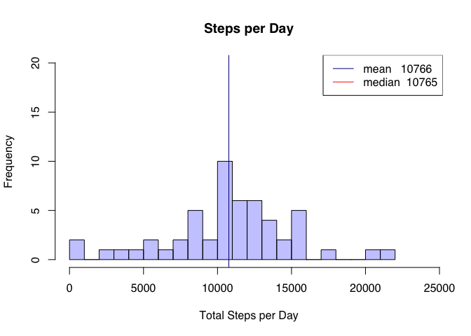
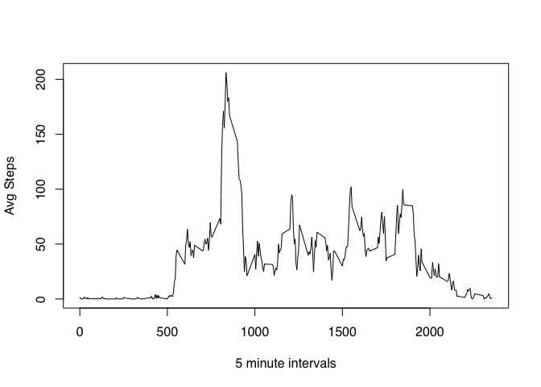
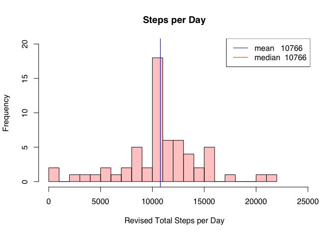
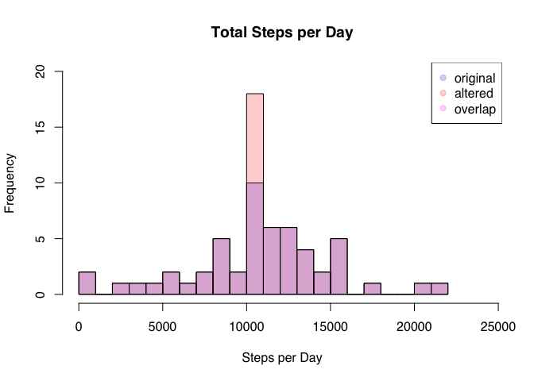
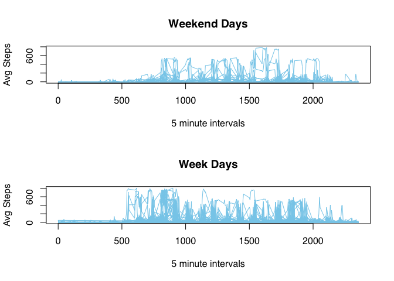

# Reproducible Research: Peer Assessment 1


## Loading and preprocessing the data
First, read the data.

```r
if (!file.exists("./activity.csv")) {
    unzip("./activity.zip")
}
activity <- read.csv("./activity.csv")
```

## What is the mean total number of steps taken per day?


```r
totalSteps <- aggregate(steps ~ date, data=activity, sum)

par(family = 'sans')
hist(totalSteps$steps, xlab="Total Steps per Day", main="Steps per Day", col=rgb(0,0,1,1/4),breaks=20, xlim=c(0,24250), ylim=c(0,20))
meanTotalSteps <- mean(totalSteps$steps, na.rm=TRUE)
medianTotalSteps <- median(totalSteps$steps, na.rm=TRUE)
abline(v=medianTotalSteps, col="red")
abline(v=meanTotalSteps, col="darkblue")
legend("topright",c(paste("mean  ",round(meanTotalSteps)),paste("median ", round(medianTotalSteps))), col=c("darkblue","red"),lwd=1)
```

<!-- -->

```r
print(paste ("The (rounded) mean total number of steps taken each day is", round(meanTotalSteps), "and the median is", round(medianTotalSteps)))
```

```
## [1] "The (rounded) mean total number of steps taken each day is 10766 and the median is 10765"
```
## What is the average daily activity pattern?

Average the number of steps taken in each time interval over all the days of the study.

```r
meanStepsPerInt <- aggregate(steps ~ interval, data=activity, mean)
maxMean = max(meanStepsPerInt$steps)
maxInt = meanStepsPerInt[meanStepsPerInt$steps == maxMean,]$interval
par(family = 'sans')
plot(x=meanStepsPerInt$interval, y=meanStepsPerInt$steps, xlab="5 minute intervals", ylab="Avg Steps", type="l")
```

<!-- -->

```
## [1] "Maximum average steps occur at Interval 835"
```

## Imputing missing values

```r
yesNAs <- subset(activity, is.na(activity$steps))
print(paste("There are", nrow(yesNAs),"NA values in the data."))
```

```
## [1] "There are 2304 NA values in the data."
```
The missing values can be replaced with the mean for that interval from other days. Looking at the resulting histogram of altered data compared to the original data shows that adding these values mostly seemed to mostly increase the frequency of days in which the subject achieved the mean number of steps. The mean and median values are substantially the same between the two datasets.

```r
newActivity <- activity
newActivity$steps[is.na(activity$steps)] <- meanStepsPerInt[match(activity$interval[is.na(activity$step)],meanStepsPerInt$interval),"steps"]
totalFixedSteps <- aggregate(steps ~ date, data=newActivity, sum)
par(family = 'sans')
hist(totalFixedSteps$steps, xlab="Revised Total Steps per Day", main="Steps per Day", col=rgb(1,0,0,1/4),breaks=20, xlim=c(0,24250), ylim=c(0,20))
meanTotalFixedSteps <- mean(totalFixedSteps$steps, na.rm=TRUE)
medianTotalFixedSteps <- median(totalFixedSteps$steps, na.rm=TRUE)
abline(v=medianTotalFixedSteps, col="red")
abline(v=meanTotalFixedSteps, col="darkblue")
legend("topright",c(paste("mean  ",round(meanTotalFixedSteps)),paste("median ", round(medianTotalFixedSteps))), col=c("darkblue","red"),lwd=1)
```

<!-- -->

```r
print(paste ("The mean total number of steps taken each day is now", round(meanTotalFixedSteps), "and the median is now", round(medianTotalFixedSteps)))
```

```
## [1] "The mean total number of steps taken each day is now 10766 and the median is now 10766"
```

```r
hist(totalSteps$steps,breaks=20, xlim=c(0,24250),ylim=c(0,20),col=rgb(0,0,1,.2), main="Total Steps per Day",xlab="Steps per Day")
hist(totalFixedSteps$steps,breaks=20, xlim=c(0,24250),ylim=c(0,20),col=rgb(1,0,0,.2),add=TRUE)
legend("topright",c("original","altered","overlap"), col=c(rgb(0,0,1,.2),rgb(1,0,0,.2), rgb(1,0,1,.2)),pch=19)
```

<!-- -->


## Are there differences in activity patterns between weekdays and weekends?
Separating the data for weekends and weekdays, we can see that activity walking activity seems to start later in the day on weekends than weekdays.

```r
weekend <- subset(newActivity,weekdays(as.Date(newActivity$date)) %in% c("Saturday","Sunday"))
weekday <- subset(newActivity, !(weekdays(as.Date(newActivity$date)) %in% c("Saturday","Sunday")))

par(mfrow=c(2,1))
par(family = 'sans')
plot(x=weekend$interval, y=weekend$steps, xlab="5 minute intervals", ylab="Avg Steps", type="l", col="skyblue", main="Weekend Days")
plot(x=weekday$interval, y=weekday$steps, xlab="5 minute intervals", ylab="Avg Steps", type="l", col="skyblue", main="Week Days")
```

<!-- -->
